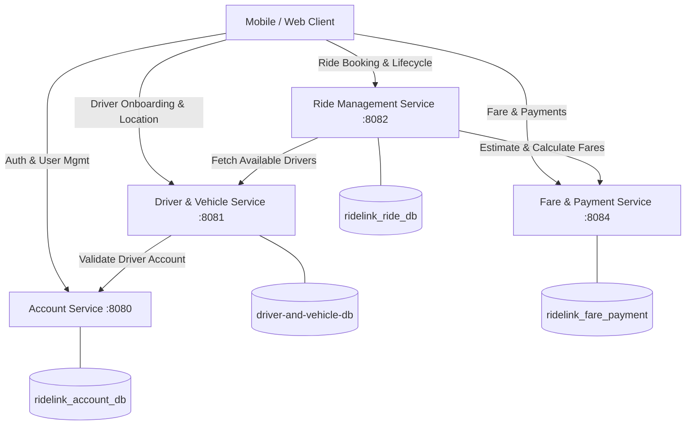

# RideLink Microservices Platform

Welcome to **RideLink**, a modern, distributed microservices-based ride-hailing and fleet management platform built with **Spring Boot 3/4**, **Java 21**, **MongoDB**, and **JWT-based Stateless Authentication**.

---

## Table of Contents
1. [Architecture & Services Overview](#1-architecture--services-overview)
2. [Prerequisites](#2-prerequisites)
3. [Configuration & Environment Variables](#3-configuration--environment-variables)
4. [Service Start-Up Order & Dependency Matrix](#4-service-start-up-order--dependency-matrix)
5. [Build, Run & Management Commands](#5-build-run--management-commands)
6. [Test Instructions & Quality Assurance](#6-test-instructions--quality-assurance)
7. [Endpoint Locations & API Reference](#7-endpoint-locations--api-reference)
8. [Sample Credentials & Test Data](#8-sample-credentials--test-data)

---

## 1. Architecture & Services Overview

The system decomposes ride-hailing domain logic into four decoupled microservices adhering to the **Database-per-Service** design pattern:



| Microservice | Default Port | Database Boundary | Primary Responsibilities |
| :--- | :--- | :--- | :--- |
| **`account-service`** | `8080` | `ridelink_account_db` | User identity registration, credential validation, HS256 JWT generation, profile management, role assignment (`PASSENGER`, `DRIVER`, `ADMIN`), and account lifecycle control (`ACTIVE`, `SUSPENDED`, `DISABLED`). |
| **`driver-and-vehicle-service`** | `8081` | `driver-and-vehicle-db` | Driver profile onboarding, vehicle specification registry (`CAR`, `VAN`, `TUK`, `BIKE`), live GPS location tracking, and real-time availability dispatching (`AVAILABLE`, `ON_TRIP`, `OFFLINE`). |
| **`ride-management-service`** | `8082` | `ridelink_ride_db` | End-to-end trip lifecycle state machine (`REQUESTED` &rarr; `ASSIGNED` &rarr; `ACCEPTED` &rarr; `IN_PROGRESS` &rarr; `COMPLETED` / `CANCELLED`), driver matching, and immutable status audit trails. |
| **`fare-payment-service`** | `8084` | `ridelink_fare_payment` | Fare estimate calculation, dynamic trip fare finalization (base rate + distance + duration + surge multiplier), and payment transaction processing (`CASH`, `CARD`). |

---

## 2. Prerequisites

Ensure the following tools and runtimes are installed on your host system:

* **Java Development Kit (JDK)**: **Java 21** or later (Tested with JDK 21 and JDK 23).
  ```bash
  java -version
  ```
* **Apache Maven**: Version 3.9+ (or use the included `mvnw` / `mvnw.cmd` wrappers in each service directory).
* **MongoDB**:
  * Local instance running on `localhost:27017` **OR**
  * MongoDB Atlas connection strings with appropriate network access (IP whitelist).
* **HTTP Testing Tool**: [Postman](https://www.postman.com/), [cURL](https://curl.se/), or [Thunder Client].
* **Operating System**: Windows (PowerShell / CMD), Linux, or macOS.

---

## 3. Configuration & Environment Variables

Each microservice is configured via Spring Boot properties with flexible environment variable overrides or dedicated `.env` files.

### 3.1 Shared JWT Security Configuration
All secured microservices (`account-service`, `driver-and-vehicle-service`, `ride-management-service`) share the identical symmetric HMAC-SHA256 signing secret and role hierarchy:
* **Secret**: Must be a high-entropy string of at least 256 bits (32+ bytes hex).
  ```properties
  JWT_SECRET=
  ```
* **Roles**: `PASSENGER`, `DRIVER`, `ADMIN` (mapped to Spring Security authorities `ROLE_PASSENGER`, `ROLE_DRIVER`, `ROLE_ADMIN`).

---

### 3.2 Service Environment Configurations

#### 1. Account Service (`account-service`)
Create or edit `account-service/.env`:
```properties
# Server
SERVER_PORT=8080

# Database
MONGODB_URI=

# Security
JWT_SECRET=
JWT_EXPIRATION_SECONDS=36000
```

#### 2. Driver & Vehicle Service (`driver-and-vehicle-service`)
Create or edit `driver-and-vehicle-service/.env`:
```properties
# Server
SERVER_PORT=8081

# Database
MONGODB_URI=

# Security
JWT_SECRET=
JWT_EXPIRATION_MS=86400000

# Inter-Service Communication Base URLs
ACCOUNT_SERVICE_URL=http://localhost:8080
RIDE_SERVICE_URL=http://localhost:8082
PAYMENT_SERVICE_URL=http://localhost:8084
```

#### 3. Ride Management Service (`ride-management-service`)
Create or edit `ride-management-service/.env`:
```properties
# Server
SERVER_PORT=8082

# Database
MONGODB_URI=

# Security
JWT_SECRET=
JWT_EXPIRATION_MS=86400000

# Inter-Service Communication Base URLs
ACCOUNT_SERVICE_URL=http://localhost:8080
DRIVER_SERVICE_URL=http://localhost:8081
PAYMENT_SERVICE_URL=http://localhost:8084
```

#### 4. Fare & Payment Service (`fare-payment-service`)
Create or edit `fare-payment-service/.env`:
```properties
# Server
SERVER_PORT=8084

# Database
MONGODB_URI=
```

---

## 4. Service Start-Up Order & Dependency Matrix

Because services validate accounts and communicate over HTTP/REST WebClients, follow this boot sequence:

```
[Step 1: MongoDB Server(s)]
           │
           ▼
[Step 2: Account Service (:8080)] ───► Handles Auth & Tokens
           │
           ├──────────────────────────┐
           ▼                          ▼
[Step 3: Fare & Payment (:8084)]   [Step 4: Driver & Vehicle (:8081)]
           │                                  │
           └──────────────────┬───────────────┘
                              ▼
               [Step 5: Ride Management (:8082)]
```

### Start-Up Rationale
1. **MongoDB**: All services require an active database connection to initialize Spring Data repositories.
2. **Account Service (`:8080`)**: Must start first so test tokens can be minted, and because `driver-and-vehicle-service` queries `/accounts/{id}` when registering drivers.
3. **Fare & Payment Service (`:8084`)**: Provides fare estimations consumed during trip creation.
4. **Driver & Vehicle Service (`:8081`)**: Validates accounts with Account Service and hosts driver location/availability.
5. **Ride Management Service (`:8082`)**: Orchestrator that queries both Driver Service and Fare/Payment Service during ride dispatching and completion.

---

## 5. Build, Run & Management Commands

### 5.1 Compiling & Packaging All Services

From the root project directory:

#### Windows (PowerShell):
```powershell
# Account Service
cd account-service; .\mvnw.cmd clean package -DskipTests; cd ..

# Driver & Vehicle Service
cd driver-and-vehicle-service; .\mvnw.cmd clean package -DskipTests; cd ..

# Ride Management Service
cd ride-management-service; .\mvnw.cmd clean package -DskipTests; cd ..

# Fare & Payment Service
cd fare-payment-service; .\mvnw.cmd clean package -DskipTests; cd ..
```

#### Linux / macOS (Bash):
```bash
for dir in account-service driver-and-vehicle-service ride-management-service fare-payment-service; do
  (cd "$dir" && ./mvnw clean package -DskipTests)
done
```

---

### 5.2 Starting Each Service (Individual Terminals)

Open four separate terminal windows:

* **Terminal 1: Account Service**
  ```powershell
  cd account-service
  .\mvnw.cmd spring-boot:run
  ```

* **Terminal 2: Driver & Vehicle Service**
  ```powershell
  cd driver-and-vehicle-service
  .\mvnw.cmd spring-boot:run
  ```

* **Terminal 3: Ride Management Service**
  ```powershell
  cd ride-management-service
  .\mvnw.cmd spring-boot:run
  ```

* **Terminal 4: Fare & Payment Service**
  ```powershell
  cd fare-payment-service
  .\mvnw.cmd spring-boot:run
  ```

---

## 6. Test Instructions & Quality Assurance

### 6.1 Running Automated Unit & Security Tests

Run the test suite in each service:

```powershell
# Account Service (30+ security, status, profile, and role tests)
cd account-service
.\mvnw.cmd test

# Driver and Vehicle Service
cd ..\driver-and-vehicle-service
.\mvnw.cmd test

# Ride Management Service
cd ..\ride-management-service
.\mvnw.cmd test

# Fare and Payment Service
cd ..\fare-payment-service
.\mvnw.cmd test
```

---

### 6.2 End-to-End Integration Flow (Step-by-Step cURL)

Follow this complete ride lifecycle test scenario:

#### Step 1: Register Passenger & Driver Accounts (Account Service)
```bash
# 1. Register Passenger
curl -X POST http://localhost:8080/api/auth/register \
  -H "Content-Type: application/json" \
  -d '{
    "firstName": "Kasun",
    "lastName": "Perera",
    "email": "kasun.passenger@example.com",
    "password": "Password123!",
    "phoneNumber": "0771234567",
    "role": "PASSENGER"
  }'

# 2. Register Driver
curl -X POST http://localhost:8080/api/auth/register \
  -H "Content-Type: application/json" \
  -d '{
    "firstName": "Nimal",
    "lastName": "Silva",
    "email": "nimal.driver@example.com",
    "password": "Password123!",
    "phoneNumber": "0719876543",
    "role": "DRIVER"
  }'
```

#### Step 2: Login to Obtain Bearer JWT Tokens
```bash
# Login Passenger
curl -X POST http://localhost:8080/api/auth/login \
  -H "Content-Type: application/json" \
  -d '{
    "email": "kasun.passenger@example.com",
    "password": "Password123!"
  }'
# -> Copy token to PASSENGER_TOKEN and id to PASSENGER_ID

# Login Driver
curl -X POST http://localhost:8080/api/auth/login \
  -H "Content-Type: application/json" \
  -d '{
    "email": "nimal.driver@example.com",
    "password": "Password123!"
  }'
# -> Copy token to DRIVER_TOKEN and id to DRIVER_USER_ID
```

#### Step 3: Register Driver Profile & Vehicle (Driver Service)
```bash
curl -X POST http://localhost:8081/api/v1/drivers \
  -H "Content-Type: application/json" \
  -H "Authorization: Bearer <DRIVER_TOKEN>" \
  -d '{
    "licenseNumber": "B1234567",
    "serviceArea": "Colombo",
    "vehicle": {
      "licensePlate": "CAB-1234",
      "make": "Toyota",
      "model": "Prius",
      "year": 2020,
      "color": "Pearl White",
      "vehicleType": "CAR",
      "capacity": 4
    }
  }'
# -> Copy driver id from response to DRIVER_ID
```

#### Step 4: Set Driver Available and Update GPS Location
```bash
# Update availability to AVAILABLE
curl -X PATCH http://localhost:8081/api/v1/drivers/<DRIVER_ID>/availability \
  -H "Content-Type: application/json" \
  -H "Authorization: Bearer <DRIVER_TOKEN>" \
  -d '{"availabilityStatus": "AVAILABLE"}'

# Update driver location (Colombo 03)
curl -X PATCH http://localhost:8081/api/v1/drivers/<DRIVER_ID>/location \
  -H "Content-Type: application/json" \
  -H "Authorization: Bearer <DRIVER_TOKEN>" \
  -d '{
    "latitude": 6.9034,
    "longitude": 79.8541,
    "address": "Kollupitiya, Colombo 03"
  }'
```

#### Step 5: Passenger Requests a Ride (Ride Management Service)
```bash
curl -X POST http://localhost:8082/api/v1/rides \
  -H "Content-Type: application/json" \
  -H "Authorization: Bearer <PASSENGER_TOKEN>" \
  -d '{
    "pickupLocation": {
      "address": "Galle Face Green, Colombo",
      "latitude": 6.9271,
      "longitude": 79.8436,
      "city": "Colombo"
    },
    "destinationLocation": {
      "address": "Independence Square, Colombo 07",
      "latitude": 6.9042,
      "longitude": 79.8678,
      "city": "Colombo"
    },
    "requestedVehicleType": "CAR",
    "estimatedDistanceKm": 4.5,
    "estimatedDurationMinutes": 15.0
  }'
# -> Copy ride id from response to RIDE_ID
```

#### Step 6: Dispatch & Ride Execution Lifecycle
```bash
# 1. Assign Driver to Ride
curl -X POST http://localhost:8082/api/v1/rides/<RIDE_ID>/assign \
  -H "Content-Type: application/json" \
  -H "Authorization: Bearer <PASSENGER_TOKEN>" \
  -d '{"driverId": "<DRIVER_ID>"}'

# 2. Driver Accepts Ride
curl -X PATCH http://localhost:8082/api/v1/rides/<RIDE_ID>/accept \
  -H "Authorization: Bearer <DRIVER_TOKEN>"

# 3. Driver Starts Ride (Status -> IN_PROGRESS)
curl -X PATCH http://localhost:8082/api/v1/rides/<RIDE_ID>/start \
  -H "Authorization: Bearer <DRIVER_TOKEN>"

# 4. Finalize Fare (Fare Service)
curl -X POST http://localhost:8084/api/fares/estimate \
  -H "Content-Type: application/json" \
  -d '{
    "rideId": "<RIDE_ID>",
    "distanceKm": 4.6,
    "durationMinutes": 16.0
  }'
# -> Copy fare id to FARE_ID

# 5. Process Payment (Fare Service)
curl -X POST http://localhost:8084/api/payments \
  -H "Content-Type: application/json" \
  -d '{
    "rideId": "<RIDE_ID>",
    "fareId": "<FARE_ID>",
    "paymentMethod": "CARD"
  }'

# 6. Complete Ride (Ride Service)
curl -X PATCH http://localhost:8082/api/v1/rides/<RIDE_ID>/complete \
  -H "Content-Type: application/json" \
  -H "Authorization: Bearer <DRIVER_TOKEN>" \
  -d '{
    "actualDistanceKm": 4.6,
    "actualDurationMinutes": 16.0,
    "finalFare": 750.00
  }'

# 7. View Immutable Audit Trail
curl -X GET http://localhost:8082/api/v1/rides/<RIDE_ID>/history
```

---

## 7. Endpoint Locations & API Reference

### 7.1 Interactive Swagger / OpenAPI Documentation
* **Driver & Vehicle Service**: [http://localhost:8081/swagger-ui/index.html](http://localhost:8081/swagger-ui/index.html)
* **Ride Management Service**: [http://localhost:8082/swagger-ui/index.html](http://localhost:8082/swagger-ui/index.html)
* **Fare & Payment Service**: [http://localhost:8084/swagger-ui/index.html](http://localhost:8084/swagger-ui/index.html)

---

### 7.2 Microservice Endpoints Matrix

#### A. Account Service (`http://localhost:8080`)
| Method | Path | Required Role / Auth | Description |
| :--- | :--- | :--- | :--- |
| `POST` | `/api/auth/register` | Public | Register new user account (`PASSENGER` or `DRIVER`). |
| `POST` | `/api/auth/login` | Public | Authenticate user; returns HS256 JWT Bearer token. |
| `GET` | `/api/users/me` | Authenticated | Retrieve profile of currently authenticated user. |
| `PUT` | `/api/users/me` | Authenticated | Update user's name or phone number. |
| `PUT` | `/api/users/me/role` | Authenticated | Switch active role between `PASSENGER` and `DRIVER`. |
| `PUT` | `/api/users/me/status`| Authenticated | Self-update status (`ACTIVE`, `SUSPENDED`, `DISABLED`). |
| `PUT` | `/api/admin/users/{userId}/role` | `ADMIN` | Administrator updates a specific user's role. |
| `PUT` | `/api/admin/users/{userId}/status` | `ADMIN` | Administrator changes status (e.g. block/unblock). |

#### B. Driver & Vehicle Service (`http://localhost:8081`)
| Method | Path | Required Role / Auth | Description |
| :--- | :--- | :--- | :--- |
| `POST` | `/api/v1/drivers` | `DRIVER`, `ADMIN` | Register driver profile & initial vehicle specs. |
| `GET` | `/api/v1/drivers/{driverId}` | Authenticated | Fetch driver details by Driver ID. |
| `GET` | `/api/v1/drivers/user/{userId}` | Authenticated | Fetch driver details by linked User ID. |
| `PUT` | `/api/v1/drivers/{driverId}/vehicle` | `DRIVER`, `ADMIN` | Update vehicle information (plate, make, model). |
| `PATCH` | `/api/v1/drivers/{driverId}/availability` | `DRIVER`, `ADMIN` | Update status (`AVAILABLE`, `ON_TRIP`, `OFFLINE`). |
| `PATCH` | `/api/v1/drivers/{driverId}/location` | `DRIVER`, `ADMIN` | Update real-time GPS coordinates. |
| `GET` | `/api/v1/drivers/available` | Public / Interservice | Query available drivers filtered by area/vehicle type. |

#### C. Ride Management Service (`http://localhost:8082`)
| Method | Path | Required Role / Auth | Description |
| :--- | :--- | :--- | :--- |
| `POST` | `/api/v1/rides` | `PASSENGER`, `ADMIN` | Create a new ride booking request. |
| `GET` | `/api/v1/rides/{rideId}` | Authenticated | Retrieve ride details by Ride ID. |
| `GET` | `/api/v1/rides/passenger/{passengerId}` | Authenticated | Retrieve ride history for a specific passenger. |
| `GET` | `/api/v1/rides/driver/{driverId}` | Authenticated | Retrieve assigned rides for a specific driver. |
| `POST` | `/api/v1/rides/{rideId}/assign` | Authenticated | Assign an available driver to a requested ride. |
| `PATCH` | `/api/v1/rides/{rideId}/accept` | `DRIVER`, `ADMIN` | Driver accepts the assigned ride. |
| `PATCH` | `/api/v1/rides/{rideId}/start` | `DRIVER`, `ADMIN` | Driver begins the trip (`IN_PROGRESS`). |
| `PATCH` | `/api/v1/rides/{rideId}/complete` | `DRIVER`, `ADMIN` | Conclude ride with final distance, duration, fare. |
| `PATCH` | `/api/v1/rides/{rideId}/cancel` | Authenticated | Cancel ride with required cancellation reason. |
| `GET` | `/api/v1/rides/{rideId}/history` | Public / Internal | Retrieve full status transition history log. |

#### D. Fare & Payment Service (`http://localhost:8084`)
| Method | Path | Required Role / Auth | Description |
| :--- | :--- | :--- | :--- |
| `POST` | `/api/fares/estimate` | Public / Interservice | Generate fare estimate for trip distance & duration. |
| `POST` | `/api/fares/{fareId}/finalize` | Public / Interservice | Finalize billable fare calculation upon trip end. |
| `GET` | `/api/fares/{fareId}` | Public / Interservice | Retrieve fare breakdown by Fare ID. |
| `GET` | `/api/fares/ride/{rideId}` | Public / Interservice | Retrieve fare breakdown by Ride ID. |
| `POST` | `/api/payments` | Public / Interservice | Create & process payment (`CASH` or `CARD`). |
| `GET` | `/api/payments/{paymentId}` | Public / Interservice | Query payment record by Payment ID. |
| `GET` | `/api/payments/ride/{rideId}` | Public / Interservice | Query payment record by Ride ID. |

---

## 8. Sample Credentials & Test Data

### 8.1 Default Test Accounts

| Persona | Email | Password | Role | Account Status |
| :--- | :--- | :--- | :--- | :--- |
| **System Admin** | `admin@ridelink.lk` | `AdminPass123!` | `ADMIN` | `ACTIVE` |
| **Driver 1** | `nimal.driver@example.com` | `Password123!` | `DRIVER` | `ACTIVE` |
| **Driver 2** | `sunil.driver@example.com` | `Password123!` | `DRIVER` | `ACTIVE` |
| **Passenger 1** | `kasun.passenger@example.com` | `Password123!` | `PASSENGER` | `ACTIVE` |
| **Passenger 2** | `amara.passenger@example.com` | `Password123!` | `PASSENGER` | `ACTIVE` |

> **Note on Admin Provisioning**: For security, public registration only allows `PASSENGER` or `DRIVER`. To create the initial `ADMIN`, insert a document directly into the `ridelink_account_db.users` collection in MongoDB with `"role": "ADMIN"`, or update an existing registered user via the Mongo shell:
> ```javascript
> db.users.updateOne({ email: "admin@ridelink.lk" }, { $set: { role: "ADMIN", status: "ACTIVE" } });
> ```

---

### 8.2 Sample JSON Payloads

#### 1. Driver Registration
```json
{
  "licenseNumber": "WP-B-8974512",
  "serviceArea": "Colombo",
  "vehicle": {
    "licensePlate": "WP CAJ-5544",
    "make": "Toyota",
    "model": "Aqua",
    "year": 2018,
    "color": "Silver",
    "vehicleType": "CAR",
    "capacity": 4
  }
}
```

#### 2. GPS Location Update
```json
{
  "latitude": 6.927079,
  "longitude": 79.861244,
  "address": "Maradana Station Road, Colombo 10"
}
```

#### 3. Ride Booking Request
```json
{
  "pickupLocation": {
    "address": "Bambalapitiya Junction, Galle Road",
    "latitude": 6.8928,
    "longitude": 79.8553,
    "city": "Colombo"
  },
  "destinationLocation": {
    "address": "One Galle Face Mall, Colombo 01",
    "latitude": 6.9256,
    "longitude": 79.8453,
    "city": "Colombo"
  },
  "requestedVehicleType": "CAR",
  "estimatedDistanceKm": 4.2,
  "estimatedDurationMinutes": 14.0,
  "estimatedFare": 650.00
}
```

#### 4. Fare Estimation Request
```json
{
  "rideId": "651a2b3c4d5e6f7a8b9c0d1e",
  "distanceKm": 4.2,
  "durationMinutes": 14.0
}
```

#### 5. Payment Transaction Request
```json
{
  "rideId": "651a2b3c4d5e6f7a8b9c0d1e",
  "fareId": "651a2b3c4d5e6f7a8b9c0d99",
  "paymentMethod": "CARD"
}
```

---

## 9. Troubleshooting & FAQ

* **Issue: `401 Unauthorized` on Driver or Ride Service**
  * *Cause*: Missing or mismatched `JWT_SECRET` in `.env`.
  * *Solution*: Ensure both services use the exact same `JWT_SECRET` configured in Account Service.
* **Issue: `403 Forbidden` on Admin endpoints**
  * *Cause*: User role in token is not `ADMIN`.
  * *Solution*: Ensure the user was assigned the `ADMIN` role in MongoDB and a fresh token was obtained via `/api/auth/login`.
* **Issue: Connection refused to MongoDB**
  * *Cause*: Local mongod service is not running or Atlas IP whitelist does not permit your current IP address.
  * *Solution*: Verify `mongod` is running or update IP Access List in MongoDB Atlas console.
